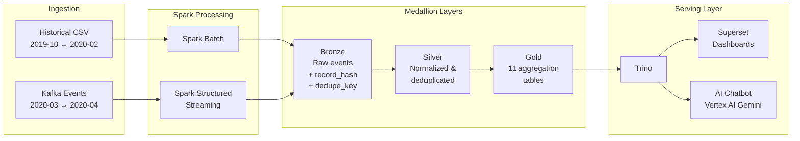
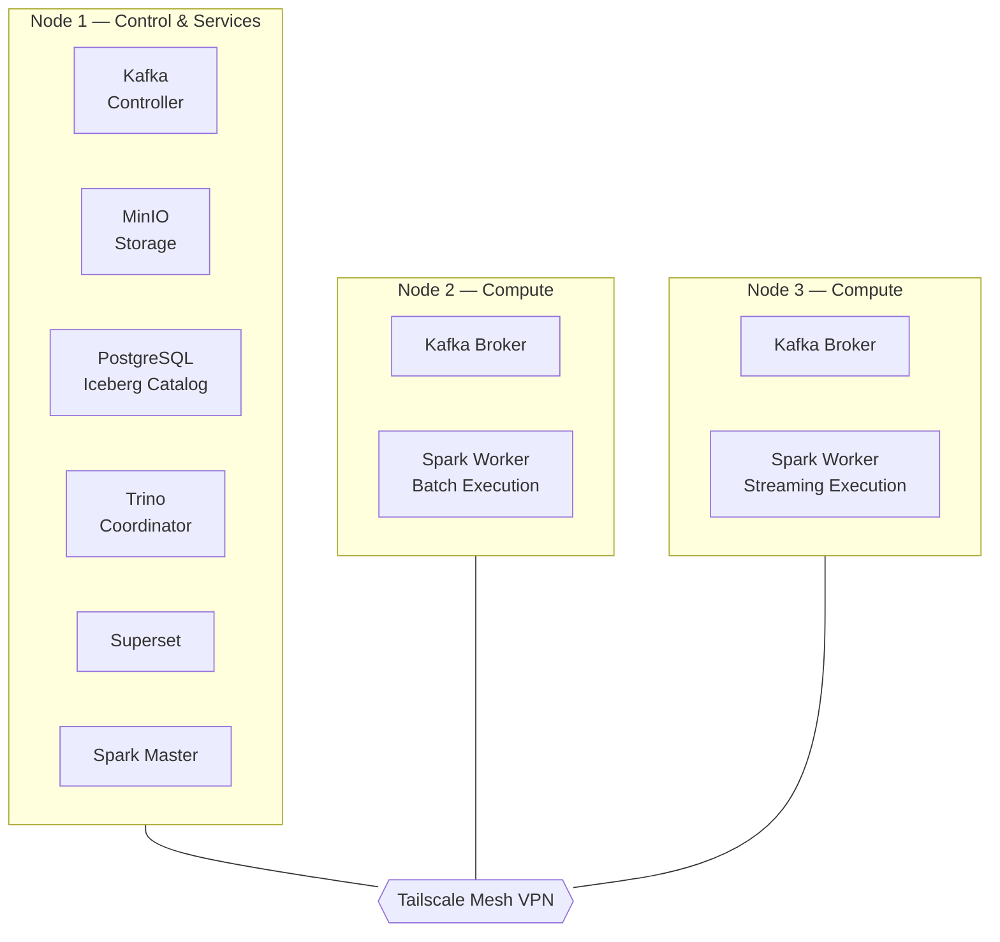

# ecommerce-lakehouse

E-commerce user-behavior analytics lakehouse implementing a medallion architecture (Bronze, Silver, Gold) on a 3-node Ubuntu cluster connected via Tailscale. Supports both historical batch backfill and near-real-time streaming ingestion with Kafka and Spark Structured Streaming.


---

## Architecture

### Data Pipeline



### Medallion Layers

- **Bronze** — Append-only raw event ingestion with source metadata, `record_hash`, and `dedupe_key` for rerun safety.
- **Silver** — Canonicalized, deduplicated, and validated events with normalized timestamps, null handling, and type coercion.
- **Gold** — Business-facing aggregation tables: `daily_revenue`, `top_products`, `conversion_funnel_daily`, `category_performance_daily`, `session_funnel`, `user_conversion_path`, `cohort_retention`, `repeat_purchase`, `product_affinity`, `time_to_conversion_distribution`, and `rfm_segmentation`.

### 3-Node Topology



Nodes communicate over Tailscale mesh VPN. Server deployment assets are under `infra/server/`.

### Pipeline Phases

| Phase | Scope | Ingestion | Processing |
|-------|-------|-----------|------------|
| Phase 1 | `2019-10` to `2020-02` historical backfill | CSV/CSV.GZ files | Spark batch into Iceberg |
| Phase 2 | `2020-03` to `2020-04` bounded streaming | Kafka replay producer | Spark Structured Streaming |
| Phase 3 | Production hardening | Mixed batch + streaming | DQ gates, manifests, benchmarks |

---

## Tech Stack

| Category | Technology | Purpose |
|----------|-----------|---------|
| Ingestion | Apache Kafka 4.1 | Durable event stream with KRaft consensus |
| Processing | Apache Spark 3.5 | Batch and Structured Streaming transformations |
| Table Format | Apache Iceberg 1.6 | ACID-compliant table format with time travel |
| Storage | MinIO (S3-compatible) | Object storage for Iceberg data and warehouse |
| Catalog | PostgreSQL (JDBC) | Iceberg catalog metadata |
| Query Engine | Trino 453 | SQL analytics over Iceberg tables |
| BI | Apache Superset | Dashboards and data exploration |
| AI | FastAPI + Vertex AI Gemini | Natural-language analytics chatbot |
| Networking | Tailscale | Mesh VPN between cluster nodes |

---

## Repository Structure

```
ecommerce-lakehouse/
├── common/                  Shared library: config, storage, quality, schemas, metrics
├── pipelines/               Medallion stage implementations
│   ├── bronze/              CSV ingestion and backfill
│   ├── silver/              Canonicalization, dedup, validation
│   └── gold/                Aggregations (revenue, funnel, retention, affinity, RFM)
├── apps/                    Entrypoints
│   ├── batch/               Local batch CLI (non-Spark path)
│   ├── streaming/           Local streaming entrypoints
│   └── producer/            Kafka replay producer
├── infra/                   Laptop/Docker Compose profile
│   ├── docker-compose.yml   Multi-service local stack
│   ├── jobs/                Spark jobs (backfill, streaming, benchmarks, DQ)
│   ├── scripts/             Bootstrap, demo, benchmark orchestration
│   ├── trino/               Trino catalog and validation SQL (laptop)
│   ├── postgres/            Catalog init SQL
│   ├── superset/            Superset bootstrap and config
│   └── local/               Local env templates
├── infra/server/            Server / 3-node deployment profile
│   ├── compose/             Per-service Docker Compose files
│   ├── env/                 Environment templates (.example files)
│   ├── scripts/             Cluster start/stop, validate, benchmark, demo
│   ├── trino/               Trino config templates (rendered at deploy time)
│   ├── spark/               Spark submit helpers
│   ├── nginx/               MinIO gateway config template
│   ├── systemd/             Service unit templates
│   └── runbooks/            Operational guides
├── chatbot/                 AI analytics chatbot
│   ├── backend/             FastAPI + Trino client + Vertex AI LLM
│   ├── frontend/            React + TypeScript + Tailwind
│   └── shared/              Gold table semantic catalog
├── scripts/                 Dev helpers (bootstrap, clean, local runs)
├── tests/                   Unit and integration tests
├── data/
│   ├── raw/                 Historical source files (gitignored)
│   └── sample/              Demo CSV inputs (3K to 100K rows)
└── docs/                    Architecture, deployment, benchmarking, runbooks
```

---

## Quick Start

### Local Development (non-Docker)

```bash
cp .env.example .env
bash scripts/bootstrap_local.sh
bash scripts/clean_local_state.sh
bash scripts/run_local_batch.sh
python3 scripts/verify_local.py
python3 -m pytest -q
```

### Docker Demo (laptop profile)

```bash
bash infra/scripts/up-bi.sh
bash infra/scripts/run-e2e-demo.sh
```

Open `http://localhost:8088`, sign in with `admin` / `admin`, and navigate to the lakehouse sample dashboard.

Customize demo size:

```bash
DEMO_SAMPLE_ROWS=50000 bash infra/scripts/run-e2e-demo.sh
```

### Bounded Streaming Demo

```bash
STREAM_SAMPLE_ROWS=1500 \
STREAM_TIMEOUT_SECONDS=150 \
STREAM_MAX_OFFSETS_PER_TRIGGER=500 \
bash infra/scripts/run-streaming-demo.sh
```

Validate streaming output:

```bash
docker exec -i ecommerce-lakehouse-laptop-trino-1 trino < infra/trino/sql/validate_streaming_phase2.sql
```

### Phase 3 Benchmarks

```bash
bash infra/scripts/run-phase3-benchmarks.sh
```

For full-scale benchmarks with external raw data:

```bash
BENCH_MODE=full BENCH_INPUT_DIR=/workspace/data/raw bash infra/scripts/run-phase3-benchmarks.sh
```

---

## Deployment Profiles

### Laptop (`infra/`)

Single-host Docker Compose simulation. Uses bounded replay defaults, small sample inputs, and container-local checkpoints. Suitable for development and demos on Docker Desktop or WSL.

```bash
cp infra/local/env/local.env.example .env
bash infra/scripts/up-core.sh
```

### Server 3-Node (`infra/server/`)

Production-oriented deployment across three Ubuntu servers connected via Tailscale. Includes clustered Kafka (KRaft), distributed MinIO, external Postgres catalog, and long-running streaming jobs.

```bash
cp infra/server/env/server.env.example    infra/server/env/server.env
cp infra/server/env/storage-minio.env.example infra/server/env/storage-minio.env
cp infra/server/env/kafka-cluster.env.example infra/server/env/kafka-cluster.env
# Edit env files with your Tailscale IPs and credentials
bash infra/server/scripts/start-kafka-cluster.sh
bash infra/server/scripts/start-streaming.sh
```

Full step-by-step guide: [docs/deployment.md](docs/deployment.md)

---

## AI Chatbot

A natural-language interface for querying Gold analytics tables, built with:

- **Backend**: FastAPI, Trino SQL client, Vertex AI Gemini 2.5 Flash
- **Frontend**: React, TypeScript, Tailwind CSS, Vite
- **Security**: Session-based auth, SQL validation layer, configurable row limits

```bash
bash infra/server/scripts/start-chatbot-stack.sh
```

Architecture details: [docs/chatbot_architecture.md](docs/chatbot_architecture.md)

---

## Key Documentation

| Document | Topic |
|----------|-------|
| [architecture.md](docs/architecture.md) | Full system architecture and data flow |
| [pipeline.md](docs/pipeline.md) | Bronze, Silver, Gold contracts and refresh models |
| [deployment.md](docs/deployment.md) | Step-by-step 3-node Ubuntu deployment |
| [local_docker.md](docs/local_docker.md) | Laptop Docker Compose architecture |
| [development.md](docs/development.md) | Local development environment and test commands |
| [operations.md](docs/operations.md) | DQ rules, manifests, metrics, recovery procedures |
| [demo_guide.md](docs/demo_guide.md) | Demo showcase walkthrough |
| [benchmarking.md](docs/benchmarking.md) | Benchmark modes, commands, and interpretation |
| [benchmark_profile.md](docs/benchmark_profile.md) | 2-month benchmark profile report |
| [chatbot_architecture.md](docs/chatbot_architecture.md) | Chatbot system design |
| [file_reference.md](docs/file_reference.md) | Key classes and functions per file |
| [improvements.md](docs/improvements.md) | Recommended next improvements |
| [references.md](docs/references.md) | Bibliography and source-quality notes |
