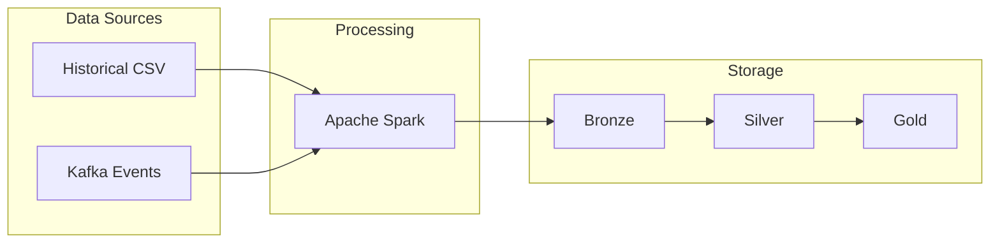

# Prompt: Repository Cleanup and Documentation Overhaul

Copy the prompt below and use it with any AI coding assistant (Claude Code, Cursor, Copilot, etc.) to audit, clean, and document a project repository.

---

## Prompt

```
You are auditing a code repository for cleanup and documentation. Follow this structured approach and execute each phase sequentially. Do not skip steps.

---

## PHASE 1 — Discovery and Inventory

### 1.1 Map the repository

Run these commands and analyze the output:

- List all tracked files: `git ls-files | sort`
- List all directories: `find . -type d -not -path '*/.git/*' | sort`
- Show repo size: `du -sh .`

Build a mental model of:
- What is this project? (read README, main entrypoints)
- What is the architecture? (read architecture docs, config files)
- How is it deployed? (read deployment guides, compose files, env templates)
- What are the core vs. auxiliary components?

### 1.2 Classify every file and folder

For each file and directory, determine:
- **Purpose**: What does it do?
- **Status**: Active, legacy, dead, or build artifact?
- **Dependencies**: What calls it? What does it call?

Create a classification table in your analysis. Mark each item as:
- `CORE` — essential for the system to run
- `AUX` — useful but not strictly required
- `LEGACY` — retained for reference, no longer in active path
- `DEAD` — zero callers, zero imports, zero purpose
- `BUILD` — auto-generated artifact, should be gitignored

---

## PHASE 2 — Security Audit

### 2.1 Find secrets in tracked files

```bash
# API keys, tokens, passwords
git ls-files | xargs grep -lE '(API_KEY|SECRET|PASSWORD|TOKEN).*=[A-Za-z0-9_\-]{10,}' 2>/dev/null

# Internal IP addresses
git ls-files | xargs grep -lE '10\.[0-9]+\.[0-9]+\.[0-9]+|172\.1[6-9]|192\.168\.' 2>/dev/null

# Default credentials
git ls-files | xargs grep -lE 'admin:admin|root:root|minioadmin' 2>/dev/null
```

### 2.2 Find environment files tracked in git

```bash
git ls-files | grep -E '\.env$|\.env\.[a-z]+$' | grep -v '.example'
```

### 2.3 Action

- `git rm --cached` all files containing secrets
- Add patterns to `.gitignore`
- Keep files on disk if the running system depends on them
- Flag any API keys that should be rotated

---

## PHASE 3 — Redundancy and Dead Code Detection

### 3.1 Find files with identical content

```bash
git ls-files | while read f; do
  echo "$(md5sum "$f" 2>/dev/null | cut -d' ' -f1) $f"
done | sort | awk 'NR>1 && $1==prev {print "DUPLICATE: " $2 " == " prev_file}
  {prev=$1; prev_file=$2}'
```

Remove the duplicate that has fewer or no callers.

### 3.2 Find files with zero references (dead code)

For every Python file:
```bash
name=$(basename "$file" .py)
grep -rl "import.*$name\|from.*$name" --include='*.py' . 2>/dev/null | grep -v "$file" | wc -l
```

For every shell script:
```bash
grep -rl "$(basename $script)" --include='*.sh' --include='*.md' --include='Makefile' . 2>/dev/null | grep -v "$script" | wc -l
```

A file is DEAD if:
- No script or Python file calls/imports it
- Its own docstring says it's legacy/replaced
- The same functionality exists elsewhere under a different name

### 3.3 Find empty or near-empty directories

```bash
find . -type d -not -path '*/.git/*' | while read dir; do
  count=$(ls -1 "$dir" 2>/dev/null | wc -l)
  if [ "$count" -eq 0 ] || ([ "$count" -eq 1 ] && [ -f "$dir/.gitkeep" ]); then
    echo "EMPTY: $dir"
  fi
done
```

### 3.4 Find redundant `.gitkeep` files

A `.gitkeep` is redundant when its directory already contains other tracked files.

### 3.5 Action

Remove all DEAD files, empty directories, redundant `.gitkeep` files, and content duplicates.

---

## PHASE 4 — Build Artifact and Binary Cleanup

### 4.1 Find build artifacts tracked in git

```bash
git ls-files | grep -E '(egg-info|\.egg|dist/|build/|\.pyc$|__pycache__)'
```

### 4.2 Find binary files tracked in git

```bash
git ls-files | xargs file 2>/dev/null | grep -vE '(ASCII|UTF-8|Python|shell|SQL|JSON|text|empty|directory|makefile)'
```

### 4.3 Action

- `git rm --cached` all build artifacts
- Add patterns to `.gitignore` (`.egg-info/`, `dist/`, `build/`, `__pycache__/`, `*.pyc`)
- Remove binary documents (`.docx`, `.pdf`, etc.) unless they are essential project docs
- Delete all `__pycache__/` and `.pyc` files from disk

---

## PHASE 5 — `.gitignore` Overhaul

### 5.1 Comprehensive `.gitignore` checklist

Ensure the following patterns are covered:

```
# Language-specific
__pycache__/       # Python
*.pyc              # Python
*.pyo              # Python
.mypy_cache/       # Python type checking
.pytest_cache/     # Python tests
node_modules/      # Node.js
dist/              # Build output
*.tsbuildinfo      # TypeScript

# Environment files
.env
.env.*
*.env
!*.env.example     # Always track example env files

# Build artifacts
*.egg-info/
build/
dist/

# Database files
*.sqlite3
*.sqlite
*.db

# Logs and runtime
logs/
*.log
checkpoints/
spark-warehouse/
metastore_db/
derby.log

# OS and editors
.DS_Store
Thumbs.db
.idea/
.vscode/
.cursorignore
*.swp
*.swo
*.bak
*.orig
*~

# Binary documents
*.docx
*.xlsx
*.pptx
*.pdf

# Hardcoded config (use .template instead)
**/hardcoded-config.properties
```

### 5.2 Verification

```bash
# Check that env files are properly ignored
git check-ignore path/to/suspicious.env

# Ensure example files are still tracked
git ls-files '*.example'
```

---

## PHASE 6 — Documentation Audit and Streamlining

### 6.1 Audit existing docs

For each document, ask:
- Does it describe the **current** system or an old version?
- Is it **essential** for running/deploying/understanding the system?
- Does it **overlap** with another document?
- Is the file name **professional** and descriptive?

Classification:
- `KEEP` — accurate, current, non-redundant
- `RENAME` — accurate but name is unclear or unprofessional
- `REMOVE` — outdated, redundant, or trivial (superseded by README)

### 6.2 Naming conventions

Use clear, professional names:
- `deployment.md` not `deployment_3node_ubuntu_v2_final.md`
- `operations.md` not `monitoring_runbook.md`
- `development.md` not `local_setup.md`
- `architecture.md` not `system_arch_overview.md`

### 6.3 Cross-reference check

```bash
# Find all file references in docs
grep -oP 'docs/[a-zA-Z0-9_/-]+\.md' docs/*.md | while read ref; do
  [ -f "$ref" ] || echo "BROKEN: $ref"
done
```

### 6.4 Action

- Remove outdated and redundant docs
- Rename remaining docs to professional names
- Update ALL cross-references across all files (README, docs, infra READMEs)
- Ensure the README documentation table is accurate

---

## PHASE 7 — README Rewrite

### 7.1 Structure

A professional README should contain:

1. **Title + one-line description**
2. **Badges** (use shields.io for tech stack: language, frameworks, infrastructure)
3. **Architecture diagrams** (use Mermaid.js — GitHub renders it natively)
4. **Medallion/layer description** (Bronze → Silver → Gold)
5. **Topology/deployment diagram** (especially for multi-node systems)
6. **Tech stack table** (Category | Technology | Purpose)
7. **Repository structure tree** (accurate, no deleted directories)
8. **Quick start commands** (copy-paste ready, tested paths)
9. **Deployment profiles** (laptop vs server, with env setup)
10. **Documentation index table** (Document | Topic)

### 7.2 Mermaid.js diagrams



GitHub, GitLab, and most Markdown renderers support Mermaid natively.

### 7.3 Badge format

```

```

Use official logo names from the Simple Icons set.

---

## PHASE 8 — Final Verification

### 8.1 Smoke test core imports

```bash
python3 -c "
from core.module1 import Something
from core.module2 import Another
print('Core OK')
"
```

### 8.2 Verify git status

```bash
git status --short     # Only intentional changes
git ls-files | wc -l   # Tracked file count
du -sh .                # Repo size
```

### 8.3 Commit with professional message

```
Author: yourname <your@email.com>

Commit message format:
<action>: <what changed> [<why>]

Examples:
- "Remove build artifacts and secrets from git tracking"
- "Streamline docs: remove 5 redundant, rename 6 for clarity"
- "Rewrite README with Mermaid diagrams and professional layout"
```

---

## QUICK REFERENCE: Commands to Run

```bash
# 1. Find secrets in tracked files
git ls-files | xargs grep -lE '(SECRET|PASSWORD|API_KEY).*=.' 2>/dev/null

# 2. Find duplicate file content
git ls-files | while read f; do md5sum "$f" 2>/dev/null; done | sort | awk 'seen[$1]++{print "DUP: "$2}'

# 3. Find dead Python files (zero imports by other files)
for f in $(git ls-files '*.py'); do
  name=$(basename "$f" .py)
  refs=$(grep -rl "import.*$name|from.*$name" --include='*.py' . 2>/dev/null | grep -v "$f" | wc -l)
  [ "$refs" -eq 0 ] && echo "DEAD: $f"
done

# 4. Find broken doc cross-references
grep -oP '(?<=\]\(|`)[a-zA-Z0-9_/. -]+\.(py|sh|sql|md|yml)' docs/*.md | while read ref; do
  [ -f "$ref" ] || echo "BROKEN: $ref"
done

# 5. Clean disk artifacts
find . -type d -name '__pycache__' -exec rm -rf {} + 2>/dev/null
find . -type f -name '*.pyc' -delete 2>/dev/null
find . -type f \( -name '*.sqlite3' -o -name '*.log' \) -delete 2>/dev/null

# 6. Final stats
git ls-files | wc -l && du -sh .
```

---

## PRINCIPLES

- **Never break the running system.** Use `git rm --cached` for config files the system needs on disk.
- **Trust `git grep` over memory.** Always verify "dead code" claims with grep before deleting.
- **One commit per phase.** Clean history is easier to review and revert.
- **Don't over-engineer.** Three near-identical lines is better than a premature abstraction.
- **Keep example files tracked.** `.env.example` files are documentation — they must stay in git.
- **When in doubt, keep it.** A 4-line script that might be useful is less harmful than deleting the wrong file.
